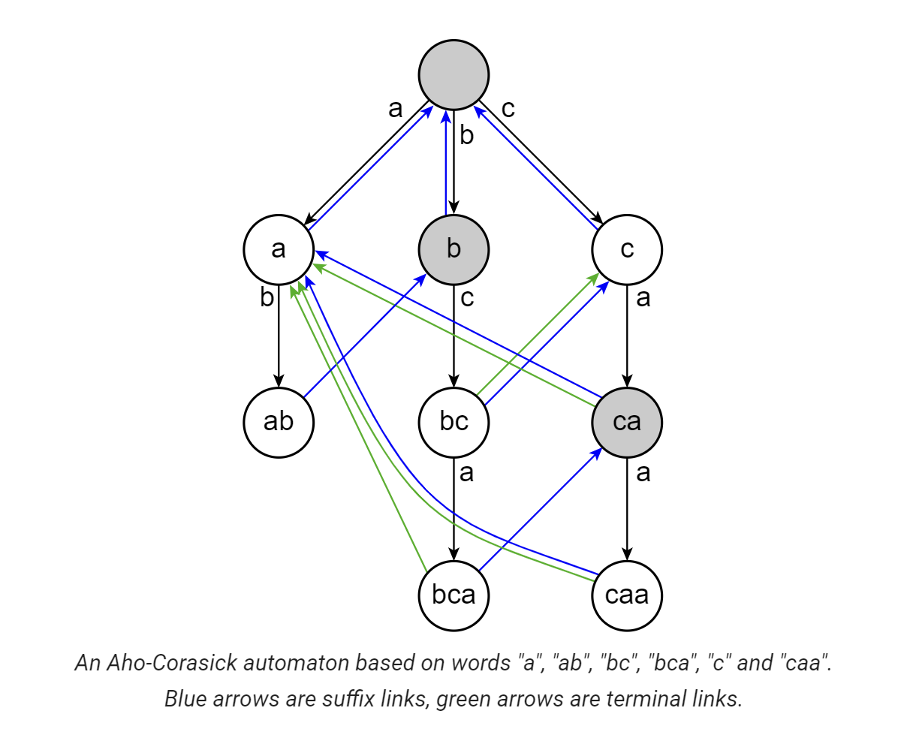

# AC自动机（Aho-Corasick）

首先回顾一下kmp算法：

```c++
#include<bits/stdc++.h>
const int N = 1e5 + 5;
std::string a, b;
int f[N];
const std::string kmp()
{
	int m = a.length();
	int n = b.length();
	f[0] = -1;
	int t = -1;
	for(int i = 0; i < n - 1; i ++ )
	{
		while(t >= 0 && b[i + 1] != b[t + 1]) t = f[t];
		if(b[i + 1] == b[t + 1])
		{
			t = t + 1;
			f[i + 1] = t;
		}
		else
		{
			f[i + 1] = -1;
		}
	}
	
	t = -1;
	for(int i = 0; i < m; i ++ )
	{
		while(t >= 0 && a[i] != b[t + 1]) t = f[t];
		if(a[i] == b[t + 1]) t ++ ;
		if(t == n - 1) return "YES";
	}
	return "NO";
	
}
int main()
{
	std::cin >> a >> b;
	std::cout << kmp() << std::endl;
}

```

AC算法的思想就是在多个串的Trie树上做KMP，进行多模式匹配，复杂度为 $O(mk)$ ，m是所有模式串的总长度，k是字符集的大小。

回顾一下trie树的构造：

```c++
#include<bits/stdc++.h>
const int K = 26;
class Vertex{
public:
	int ne[K];
	bool output = false;
	Vertex()
	{
		std::fill(std::begin(ne), std::end(ne), -1);
	}
};
std::vector<Vertex> trie(1);
void add_string(std::string s)
{
	int v = 0;
	for(auto ch : s)
	{
		int c = ch - 'a';
		if(trie[v].ne[c] == -1)
		{
			trie[v].ne[c] = trie.size();
			trie.emplace_back();//emplace_back() can be called without arguments.
		}

		v = trie[v].ne[c];
	}
	trie[v].output = true;
}
int main()
{
	std::string s;
	std::cin >> s;
	add_string(s);
	std::cout << trie.size() << '\n';
}
```

考虑一个已经插入多个模式串的trie，假设我们已经到达了一个对应串t的状态，如果t有一个对应接下来字符c的边，那么可以直接匹配t+c，但是如果没有，那么我们需要考虑转移到一个“前缀与串t后缀匹配且最长”的其他串，然后从那里继续比较接下来的字符是否与c匹配。



如上图所示，假设我们已经到达了匹配ab的状态，接下来要匹配c，但是在ab状态我们无法继续匹配了，所以要找到某个与ab后缀匹配的最长前缀，该例中是串bca的前缀，所以我们转移到节点b，并从此处开始匹配。

**suffix link** （失配指针）：定义一个节点的suffix link指向与当前节点对应的串的真后缀相匹配的节点，即上图中的蓝色箭头，根节点的suffix link指向其本身。

如何构造每个节点的suffix link：根节点与其孩子节点的suffix link指向根节点。对于其他节点v，若p是v的父节点且p通过字符c转移到v，即trie[p,c] = v, 那么转移到p的suffix link（以下用fail[p]指代）所指的节点fail[p]，并查看能否通过字符c转移到下一个节点，如果可以，则令fail[v] = trie[fail[p],c]，如果不能，则继续寻找fail[p]节点的suffix link指向的节点并尝试用c匹配，即寻找trie[fail[fail[p]],c]，如此类推，如果实在找不到，则指向根节点。

```c++
#include<bits/stdc++.h>
const int K = 26;
int ans = 0;
class Vertex{
public:
	int next[K];
	bool output = false;
	int p = -1;//parent
	char pch;//trie[p,pch] = current node
	int link = -1;//suffix link
	int go[K];//match function of automaton
	Vertex(int p = -1, char ch = '$'): p(p), pch(ch)
	{
		std::fill(std::begin(next), std::end(next), -1);
		std::fill(std::begin(go), std::end(go), -1);
	}
};
std::vector<Vertex> trie(1);
void add_string(std::string s)
{
	int v = 0;
	for(auto ch : s)
	{
		int c = ch - 'a';
		if(trie[v].next[c] == -1)
		{
			trie[v].next[c] = trie.size();
			trie.emplace_back(v, ch);
		}

		v = trie[v].next[c];
	}
	trie[v].output = true;
}
int go(int v, char ch);
int get_link(int v)
{
	if(trie[v].link == -1)
	{
		if(v == 0 || trie[v].p == 0)
		{
			trie[v].link = 0;
		}
		else
		{
			trie[v].link = go(get_link(trie[v].p), trie[v].pch);
		}
	}
	return trie[v].link;
}
int go(int v, char ch)
{
	int c = ch - 'a';
	if(trie[v].go[c] == -1)
	{
		if(trie[v].next[c] != -1)
		{
			trie[v].go[c] = trie[v].next[c];
		}
		else
		{
			trie[v].go[c] = v == 0 ? 0 : go(get_link(v), ch);
		}
	}
	return trie[v].go[c];
}
```

使用BFS来构造AC自动机，可以将构建的时间复杂度从O(mk) 优化为 O(nk) ，其中n是节点数；

[模板题](https://www.luogu.com.cn/problem/P3808)

```c++
#include<bits/stdc++.h>
const int K = 26;
class Vertex{
public:
	int next[K];
	int output = 0;
	int link = -1;//suffix link
	Vertex()
	{
		std::fill(std::begin(next), std::end(next), -1);
	}
};
std::vector<Vertex> trie(1);
void add_string(std::string s)
{
	int v = 0;
	for(auto ch : s)
	{
		int c = ch - 'a';
		if(trie[v].next[c] == -1)
		{
			trie[v].next[c] = trie.size();
			trie.emplace_back();
		}

		v = trie[v].next[c];
	}
	trie[v].output ++;
}
void build()
{
	trie[0].link = 0;
	std::queue<int> q;
	for(int i = 0 ; i < 26; i ++ )
	{
		if(trie[0].next[i] != -1) 
		{
			trie[trie[0].next[i]].link = 0;
			q.push(trie[0].next[i]);			
		}
		
	}
	while(q.size())
	{
		auto t = q.front();
		q.pop();
		for(int i = 0; i < 26; i ++ )
		{
			if(trie[t].next[i] != -1)
				trie[trie[t].next[i]].link = trie[trie[t].link].next[i], q.push(trie[t].next[i]);
			else
				trie[t].next[i] = trie[trie[t].link].next[i];//注意这里修改了trie的结构从而消除了递归，将trie树变成了trie图
		}
	}
}
/*
3
dabce
abc
bc
dabc
*/
int query(std::string str)
{
	int ans = 0;
	int cur = 0;
	for(auto ch : str)
	{
		cur = trie[cur].next[ch - 'a'];
		for(int i = cur; i > 0 && trie[i].output != -1; i = trie[i].link)
		{
			ans += trie[i].output;
			trie[i].output = -1;
		}
	}
	return ans;
}
int main()
{
	int n;
	std::cin >> n;
	for(int i = 0; i < n; i ++ )
	{
		std::string s;
		std::cin >> s;
		add_string(s);

	}
	build();
	std::string str;
	std::cin >> str;
	
	std::cout << query(str) << '\n';
}
```

## 例题

[UVA-11590](https://vjudge.net/problem/UVA-11590)

思路很平凡，唯一要注意的是卡unsigned long long，m = 64和查询串为*的情况要特判。

```c++
#include<bits/stdc++.h>
using ll = unsigned long long;
ll n, m;
const ll K = 2;
class Vertex{
public:
	ll ne[K];
	bool output = false;
	ll card = 0;
	ll len = 0;
	ll ans = 0;
	Vertex()
	{
		std::fill(std::begin(ne), std::end(ne), -1);
	}
};
std::vector<Vertex> trie;
void add_string(std::string s)
{
	ll v = 0;
	for(char ch : s)
	{
		if(ch == '*') break;
		ll c = ch - '0';
		if(trie[v].ne[c] == -1)
		{
			ll nt = trie.size();
			trie[v].ne[c] = nt;
			trie.emplace_back();
			trie[nt].len = trie[v].len + 1;
			
		}
		v = trie[v].ne[c];
	}
	trie[v].output = true;
	trie[v].card = (1ull << (m - trie[v].len));
	//std::cout << m - trie[v].len << ' ' << trie[v].card << '\n'; 
}

ll dfs(ll cur)
{
	if(cur == -1)
	{
		return 0;
	}
	if(trie[cur].output == true)
	{
		trie[cur].ans = trie[cur].card;
		for(ll i = 0; i < K; i ++ )
		{
			if(trie[cur].ne[i] != -1)
			{
				trie[cur].ans -= dfs(trie[cur].ne[i]);
			}
		}
		return trie[cur].card;
	}
	else
	{
		ll r = 0;
		for(ll i = 0; i < K; i ++ )
		{
			if(trie[cur].ne[i] != -1)
			{
				r += dfs(trie[cur].ne[i]);
			}
		}
		return r;
	}
}
ll match(std::string s)
{
	ll v = 0;
	for(char ch : s)
	{
		if(ch == '*') break;
		ll c = ch - '0';
		v = trie[v].ne[c];
	}
	return trie[v].ans;
}
void solve()
{
	trie.clear();
	trie.emplace_back();
	if(m < 64)
		trie[0].card = (1ull << m);
	else 
		trie[0].card = ((1ull << 63) - 1 + (1ull << 63));//use 1 << 64 directly will overflow
	//std::cout << trie[0].card << '\n';
	trie[0].output = true;
	for(ll i = 0; i < n; i ++ )
	{
		std::string s;
		std::cin >> s;
		add_string(s);
	}
	dfs(0);
	ll q;
	std::cin >> q;
	while(q -- )
	{
		std::string s;
		std::cin >> s;
		if(m == 64 && s == "*")//when m == 64, ull will overflow.
		{
			std::cout << match(s) + 1 << '\n';
		}
		else
		{
			std::cout << match(s) << std::endl;
		}
		
	}
}
/*
2 64
0*
1*
1
*
*/
int main()
{
	while(std::cin >> n >> m)
	{
		if(n == 0 || m == 0)
		{
			return 0;
		}
		else
		{
			solve();
			std::cout << std::endl;
		}
	}

}
```

